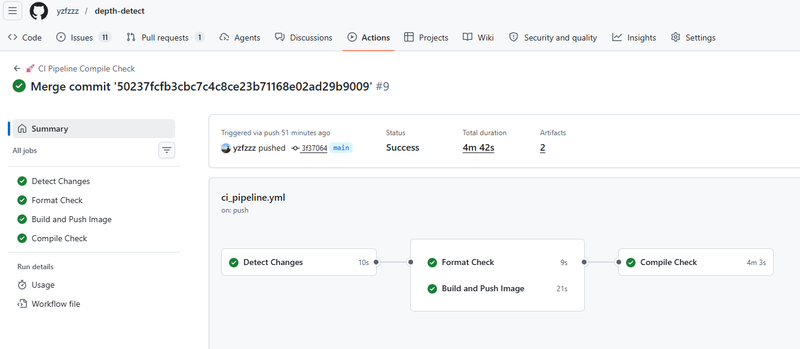

# 🚀 depth-detect：目标检测 + 深度融合框架

本项目是一个基于 C++ 与 TensorRT 的高性能视觉推理框架，融合 **YOLO** 目标检测与 **单目/双目深度估计（Depth-Anything / Lite-Mono）**，并在检测结果上叠加基于卡尔曼滤波的运动状态（速度 / 加速度 / 距离变化）估计。兼容 x86 与嵌入式（aarch64，Jetson）平台，提供同步与异步两种推理流水线

**⭐ 快速亮点**
- 🎯 多模型并行（Depth + Detection）流水线（Sync / Async）
- ⚡ CUDA 前/后处理并行加速（Resize、Normalize、NMS）
- 📍 基于 BYTETracker 的多目标跟踪 + 卡尔曼滤波运动平滑
- 🔧 支持跨平台构建（x86 / Jetson）

⚠️ **注意**：对于B站视频中旧版的代码，请运行：
```bash
git fetch origin
git checkout release/v1.0
```
---

## 📚 目录 (Table of Contents)
- [技术栈](#技术栈)
- [快速上手](#快速上手)
- [系统架构](#系统架构)
- [测试与基准](#测试与基准)
- [开发与贡献](#开发与贡献)

---

<a id="技术栈"></a>
## 🛠️ 技术栈

- 💻 语言：C++14
- 📦 构建：CMake 3.10+
- 🎯 推理后端：TensorRT（兼容 8.x / 10.x）
- ⚙️ 并行/加速：CUDA、cuBLAS、cuDNN、CUB
- 🖼️ 视觉处理：OpenCV 4.x
- 📊 基准测试：Google Benchmark
- 🤖 算法：Yolo，DepthAnything，LiteMono，BYTETracker

---

<a id="快速上手"></a>
## 🚀 快速上手

1. 克隆仓库：

```bash
git clone https://github.com/yzfzzz/depth-detect.git
cd depth-detect
```

2. 初始化子模块：

```bash
./env.sh
```

3. 准备模型：

- 将已转换的 `.engine` 放到 `model/engine/`。常见路径示例：

```
model/engine/
  ├─ yolov8s_s640_ws1024_fp16.engine
  └─ lite_mono-8m_op12_s640_ws-all_fp16.engine
```

4. 依赖安装（Jetson）

```bash
sudo apt-get update
sudo apt-get install -y build-essential cmake git libyaml-cpp-dev libopencv-dev libbenchmark-dev
# Jetson 需安装对应的 TensorRT SDK 与 CUDA（通常系统自带或通过 NVIDIA JetPack 安装）
```

5. 构建项目：

```bash
mkdir -p build && cd build
cmake ..
make -j$(nproc)
```

6. 构建 Docker 镜像（推荐）：

- 如果你希望在容器中运行项目，可以使用仓库根目录的 Dockerfile 构建镜像（以 Win11 为例，注意 Dockerfile 需拉取对应版本的镜像）：

```bash
# 驱动版本建议保持一致，其他版本自行查询 NVIDIA 官网
root@f9a6dd113c50:/home/work/depth-detect# nvidia-smi
Sun May 24 13:42:29 2026
+-----------------------------------------------------------------------------------------+
| NVIDIA-SMI 573.22                 Driver Version: 573.22         CUDA Version: 12.8     |
|-----------------------------------------+------------------------+----------------------+
| GPU  Name                  Driver-Model | Bus-Id          Disp.A | Volatile Uncorr. ECC |
| Fan  Temp   Perf          Pwr:Usage/Cap |           Memory-Usage | GPU-Util  Compute M. |
|                                         |                        |               MIG M. |
|=========================================+========================+======================|

root@f9a6dd113c50:/home/work/Stereo-Detection# cat Dockerfile 
# CUDA Version: 12.8，Driver Version: 573.22对应的基础镜像
FROM nvcr.io/nvidia/tensorrt:25.04-py3
```

```bash
# 在仓库根目录运行
docker build -t depth-detect:latest .

xhost +local:root

# 运行镜像
docker run --gpus all -it --restart=unless-stopped --name depth_detect  -v ./work:/home/work  -e DISPLAY=host.docker.internal:0.0  depth-detect:latest
```

- 镜像内的构建与运行（容器内示例）：

```bash
mkdir -p build && cd build
cmake ..
make -j$(nproc)
cd ../bin
./main ../data/shu/1shu_east_0514.mp4
```

7. 运行主程序（示例）：

```bash
cd ../bin
./main ../data/shu/1shu_east_0514.mp4
```


---

<a id="系统架构"></a>
## 📐 系统架构


1. 数据接入层（Data Ingest）
2. 核心调度层（Pipeline / Task Scheduler）
3. 算法推理层（Depth 分支、Detection 分支、Tracker）
4. 状态与交互层（MotionState/Display/IO）
5. 基础设施层（TensorRT / CUDA / CUB）

---


<a id="测试与基准"></a>
## 📊 测试与基准（Benchmark）

项目集成 Google Benchmark 用于测量不同执行策略的吞吐/延迟

```bash
cd ./bin
./test_pipeline
./test_depth_preprocess
```
### 同步改异步，流水线并行

| 指标 | NV5060 同步 | NV5060 异步 | NV5060 改进 | TX2 同步 | TX2 异步 | TX2 改进 |
| :--- | :--- | :--- | :--- | :--- | :--- | :--- |
| Wall Time (ms/帧) | 10.7 | 9.80 | -8.4% ↓ | 159 | 150 | -5.7% ↓ |
| CPU Time (ms) | 10.7 | 9.64 | -9.9% ↓ | 43 | 35 | -18.6% ↓ |
| 吞吐量 | 93.33 | 103.79 | +11.2% ↑ | 23.38 | 28.75 | +23.0% ↑ |
| 迭代次数 | 66 | 72 | +6 ↑ | 16 | 20 | +4 ↑ |

### 深度模型前处理 cpu 改 cuda加速

| 平台 | 处理方式 | 平均耗时 | 吞吐量 | GPU相对CPU的性能提升倍数 |
| :--- | :--- | :--- | :--- | :--- |
| Jetson TX2 | CPU预处理 (含Copy) | 13 ms | 76.75 items/s | 约 9.1 倍 |
| Jetson TX2 | GPU深度图预处理 | 2 ms | 696.23 items/s | - |
| NV5060 | CPU预处理 (含Copy) | 2.71 ms | 356.30 items/s | 约 7.6 倍 |
| NV5060 | GPU深度图预处理 | 0.355 ms | 2709.07 items/s | - |


<a id="开发与贡献"></a>
## 💬 开发与贡献

- 提交 PR 前请运行 format.sh 对代码进行格式化
- 确保 CI 流水线全部通过

---

## 📄 许可证

见仓库根目录 `LICENSE`

---


*✨ Generated by yzfzzz*
