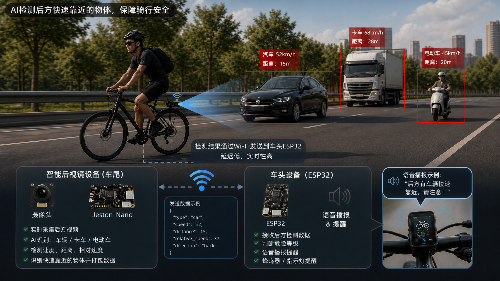
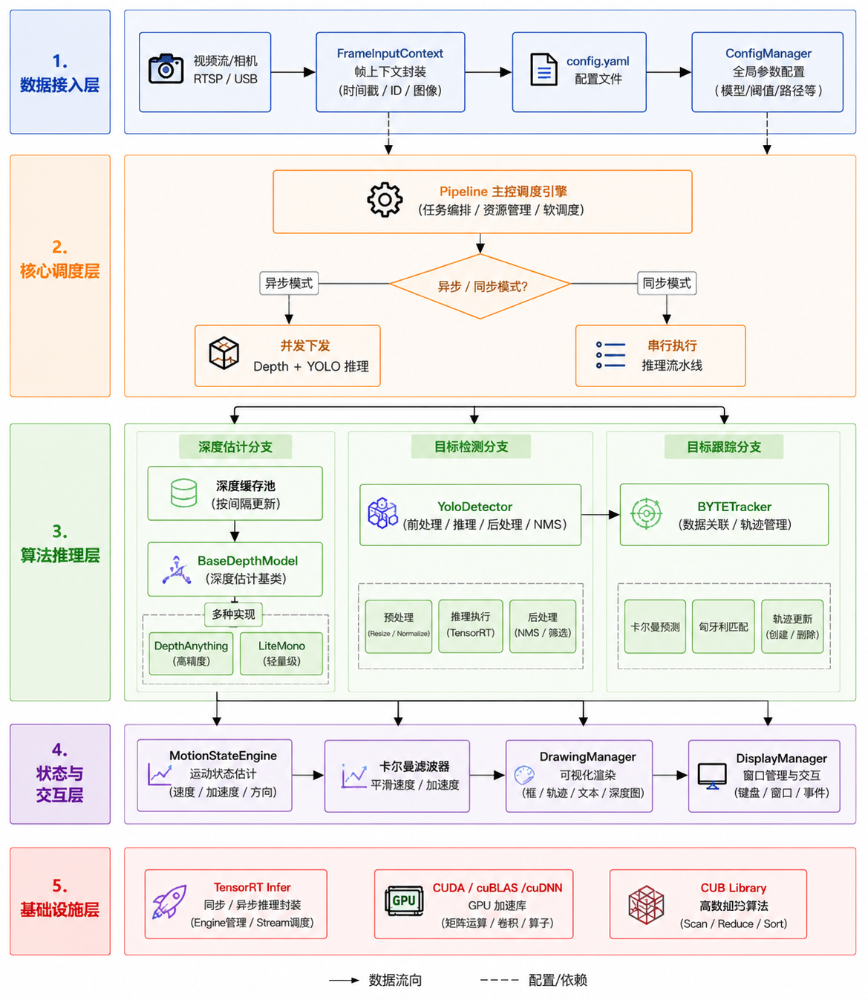

# Stereo-Detection — C++ / TensorRT 实时目标检测 + 深度融合框架

本项目是一个基于 C++ 与 TensorRT 的高性能视觉推理框架，融合 **YOLO** 目标检测与 **单目/双目深度估计（Depth-Anything / Lite-Mono）**，并在检测结果上叠加基于卡尔曼滤波的运动状态（速度 / 加速度 / 距离变化）估计。框架兼顾高端 GPU（x86）与嵌入式（aarch64，Jetson）平台，提供同步与异步两种推理流水线以适配不同的延迟/吞吐取舍。

**快速亮点**
- 多模型并行（Depth + Detection）流水线（Sync / Async）
- GPU 端尽可能的前/后处理并行（Resize、Normalize、NMS 在 GPU 上）
- 基于 BYTETracker 的多目标跟踪 + 卡尔曼滤波运动平滑
- CMake 平台嗅探（自动为 Jetson / x86 选择优化编译参数）

---

## 目录 (Table of Contents)
- [技术栈](#技术栈)
- [快速上手](#快速上手)
- [整体架构与图解](#整体架构与图解)
- [关键模块说明（逐层）](#关键模块说明逐层)
- [配置项与示例 (`cpp/bin/config.yaml`)](#配置项与示例-cppbincconfigyaml)
- [构建与运行](#构建与运行)
- [测试与基准（Benchmark）](#测试与基准benchmark)
- [平台差异化调优（Jetson / x86）](#平台差异化调优jetson--x86)
- [常见问题与排查](#常见问题与排查)
- [开发与贡献](#开发与贡献)

---

## 技术栈

- 语言：C++14
- 构建：CMake 3.10+
- 推理后端：TensorRT（兼容 8.x / 10.x）
- 并行/加速：CUDA、cuBLAS、cuDNN、CUB
- 视觉处理：OpenCV 4.x
- 配置：yaml-cpp
- 基准测试：Google Benchmark
- 算法：Yolo，DepthAnything，LiteMono，BYTETracker

---

## 快速上手

1. 克隆仓库：

```bash
git clone https://github.com/your-username/Stereo-Detection.git
cd Stereo-Detection
```

2. 初始化子模块（若需要）：

```bash
git submodule update --init --recursive
```

3. 准备模型：

- 将 ONNX 或已转换的 `.engine` 放到 `model/engine/`。常见路径示例：

```
model/engine/
  ├─ yolov8s_s640_ws1024_fp16.engine
  └─ lite_mono-8m_op12_s640_ws-all_fp16.engine
```


4. 构建项目：

```bash
cd cpp
mkdir -p build && cd build
cmake ..
make -j$(nproc)
```

5. 运行主程序（示例）：

```bash
cd ../bin
./main ../../data/shu/1shu_east_0514.mp4
```

程序会在 GUI（若启用）显示融合后的检测、深度、运动指示；同时终端打印帧率/耗时信息。

---

## 整体架构与图解


下图为本框架的分层视角（图中标注 1~5 层）：

1. 数据接入层（Data Ingest）
2. 核心调度层（Pipeline / Task Scheduler）
3. 算法推理层（Depth 分支、Detection 分支、Tracker）
4. 状态与交互层（MotionState/Display/IO）
5. 基础设施层（TensorRT / CUDA / CUB）

该图以数据流为主轴（实线），并用虚线表示配置/依赖。下面在“关键模块说明（逐层）”中基于图逐步解释。

---

## 关键模块说明（逐层）

以下按图中层级从上到下说明模块职责与关键文件位置：

### 1) 数据接入层（Data Ingest）

- 功能：从摄像头/视频/RTSP/文件读取帧、封装时间戳与元数据。
- 关键类型：`FrameInputContext`（封装 `frame_id`、时间戳、原始 `cv::Mat`）。
- 关联代码：`cpp/main.cpp`（入口）、`cpp/tools/`（IO 相关）。

设计要点：时间戳精度对卡尔曼滤波/速度估计非常关键，务必使用高精度计时并传递 `dt`。

### 2) 核心调度层（Pipeline）

- 功能：接收 `FrameInputContext` 后负责调度 Depth 与 Detection 推理（两种模式：同步串行 / 异步帧内并行），并组织后续流程（Tracker、MotionState、Draw）。
- 主要文件：`cpp/core/pipeline.h`、`cpp/core/pipeline.cpp`。
- 两种执行策略：
  - 同步（`process`）: 保证每帧完成所有推理再返回（延迟更可控，适实时低延迟）。
  - 异步（`processAsync`）: 在一个帧周期内将 Depth 与 YOLO 投递到不同 `cudaStream`，以提升吞吐（适批量处理或高端 GPU）。

注意：项目中存在“帧内并发”（在同一帧同时投递多个模型）与“跨帧流水线”（真正的 pipelining，将不同帧分阶段重叠）概念区别。对实时低延迟场景，推荐使用同步模式；对吞吐优先场景，启用异步或进一步实现跨帧流水线。

### 3) 算法推理层（Depth / Detection / Tracker）

- Depth 分支：`cpp/depth/` 下封装 `BaseDepthModel`（接口），支持 `Depth-Anything` 与 `LiteMono` 等实现。产生整图深度图或 ROI 深度。
- Detection 分支：`cpp/detect/` 下封装 `YoloDetector`，负责前处理（GPU resize/normalize）、推理（TensorRT `enqueue` / `enqueueV3`）与后处理（GPU NMS）。
- Tracker：`cpp/bytetrack/` 集成 BYTETracker，实现 target ID 持久化、丢失/重连策略。

GPU 优化点：尽量让前处理、推理与后处理在 GPU 上完成，减少 D2H/H2D 复制；使用流（streams）并重用 TensorRT 上下文/缓冲区。

### 4) 状态与交互层（MotionState / Drawing / Display）

- MotionStateEngine：位于 `cpp/core/`，使用 `cv::KalmanFilter` 做二阶运动估计（位置/速度/加速度）。输入为由 Tracker 提供的 `track_id` + ROI 深度样本。
- DrawingManager / DisplayManager：负责渲染（框、深度热图、速度箭头、文本）与窗口管理。可选关闭 GUI（用于 headless 环境）。

### 5) 基础设施层（TensorRT / CUDA / CUB）

- TensorRT：负责序列化/反序列化模型（`.engine`），上下文/流调度。
- CUDA / cuBLAS / cuDNN：用于加速核心算子与网络推理。
- CUB：用于高性能并行算法（scan/reduce/sort），部分 GPU NMS 或前处理会调用。

---

## 配置项与示例

项目在 `bin/config.yaml` 中集中管理运行时参数（无需重编译即可调整）。常用字段示例：

| 键名 | 说明 | 示例 |
|---|---:|---|
| `display_manager.is_display` | 是否启用 GUI 窗口 | `true` / `false` |
| `yolo.yolo_engine` | YOLO engine/onnx 路径 | `model/engine/yolov8s.engine` |
| `yolo.conf_thresh` | 目标置信度阈值 | `0.25` |
| `yolo.nms_thresh` | NMS IOU 阈值 | `0.45` |
| `depth.depth_engine` | 深度模型 engine 路径 | `model/engine/lite_mono.engine` |
| `depth.depth_interval` | 抽帧深度估计间隔（2=隔帧） | `1` |
| `motion_state_engine.velocity_threshold` | 判定趋近/远离速度阈值（单位根据配置） | `20` |

调参建议：在 Jetson 上适当增加 `depth_interval`（比如 2 或 3）以降低推理压力；在 x86 上可设置 `depth_interval=1` 做高频深度估计。

---

## 构建与运行（详尽步骤）

### 依赖安装（Ubuntu / Jetson）

```bash
sudo apt-get update
sudo apt-get install -y build-essential cmake git libyaml-cpp-dev libopencv-dev libbenchmark-dev
# Jetson 需安装对应的 TensorRT SDK 与 CUDA（通常系统自带或通过 NVIDIA JetPack 安装）
```

### 编译（示例）

```bash
mkdir -p build && cd build
cmake ..
make -j$(nproc)
```

### 运行主程序

```bash
cd ../bin
# 使用 video 文件
./main ../data/shu/1shu_east_0514.mp4
# 或使用摄像头（0 为设备号）
./main 0
```

### 运行基准测试

```bash
cd ./bin
./pipeline_test
```

注意：若遇到 Google Benchmark 输出 `Library was built as DEBUG` 警告，可自行从源码编译 `benchmark` 为 `Release`。

---

## 测试与基准（Benchmark）

项目集成 Google Benchmark 用于测量不同执行策略的吞吐/延迟。常见结论：

- 高端 GPU（如 RTX 5060）：异步/多流通常能带来可观吞吐提升（Multi-Stream 自动优化）。
- 边缘设备（Jetson TX2/Nano）：由于受限于寄存器 / L2 / 带宽，帧内异步若在 host 阻塞（`cudaStreamSynchronize`）情况下未必带来延迟优势；实时低延迟场景推荐使用同步模式。

基准注意点：确保在注册 benchmark 的测试中加入 warmup（若干次空跑）以避免首帧 TensorRT 构建或显存分配带来的冷启动影响。


## 开发与贡献

- 若提交补丁，请先在 `cpp` 下运行 `make` 与 `./pipeline_test`，确保基准与编译通过。
- 提交 PR 前请运行 clang-format（若项目中有格式化配置）。

---

## 许可证

见仓库根目录 `LICENSE`。

---


*Generated by Stereo-Detection Dev Team*
